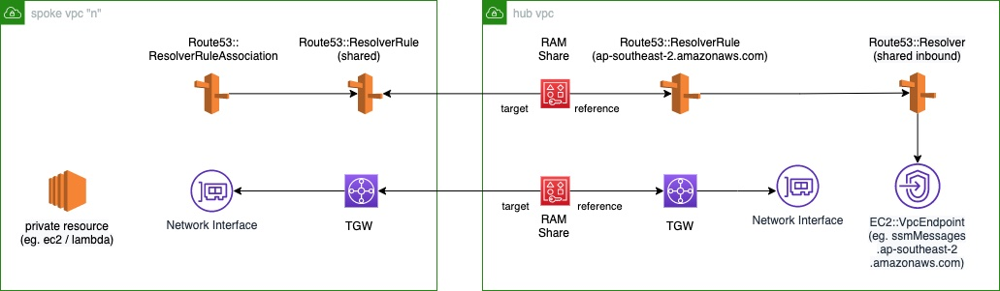

## Sharing VPC Endpoints across multiple connected VPCs

The pattern describes how to setup VPC Endpoints within a shared services VPC, create corresponding Route53 Resolver rules and share them to all connected VPCs.

## Prerequisites and limitations
### Prerequisites
- Two or more connected VPCs using AWS Transit gateway
- One VPC configured as a hub or shared services VPC to host the VPC endpoints and Route53 resolvers

### Limitations

- Multi-Region deployments require the duplication of VPC endpoints, inbound and outbound resolvers and related resolver rules in each region.
- VPC DNS resolution must be enabled in the Shared VPC. If custom DNS servers are used within the VPC, this servers have to be configured to forward requests for <region>.amazonaws.com to the Inbound Resolver or VPC DNS Resolver
- Not all services support accessing a VPC Endpoint deployed into a different VPC
## Deployment
1. Deploy hub.yml in one AWS account acting as hub to deploy VPC Endpoints
2. Deploy spoke.yml in second AWS account acting as workload account
3. Connect the EC2 instance in spoke account
    1. resolve IP address for kms.[region].amazonaws.com - should return a IP addresses in the 10.0.0.0/22 range
    2. resolve IP address for states.[region].amazonaws.com - should return a public IP address

## Security

See [CONTRIBUTING](CONTRIBUTING.md#security-issue-notifications) for more information.

## License

This library is licensed under the MIT-0 License. See the LICENSE file.

